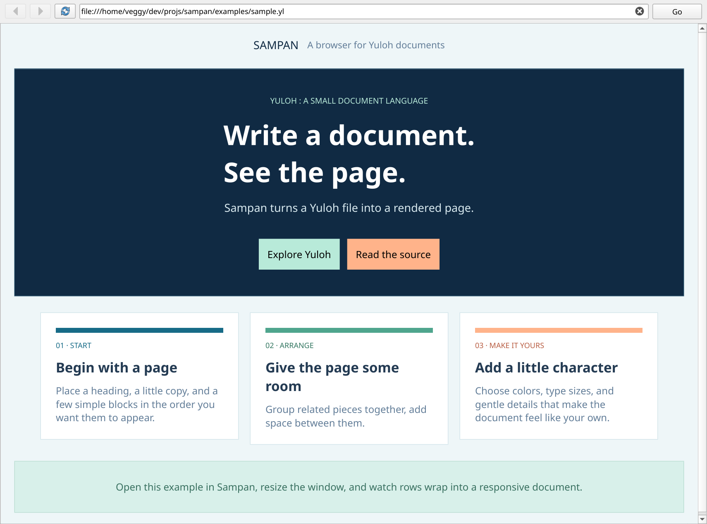

# Sampan

Sampan is a browser for documents written in [Yuloh](docs/yuloh-language.md) (a custom document language).

Sampan rendering a [sample AI-generated yuloh document](examples/sample.yl):


## Build

### Requirements 
* Compiler with C++23 support
* Qt6
* CMake 3.28+

```sh
make
```

## Usage

Running `sampan` without arguments opens the browser home page.

Within the navigation bar, fill in the relative path/ url for a yuloh document.

## Docs
* [Yuloh Language Reference](docs/yuloh-language.md)